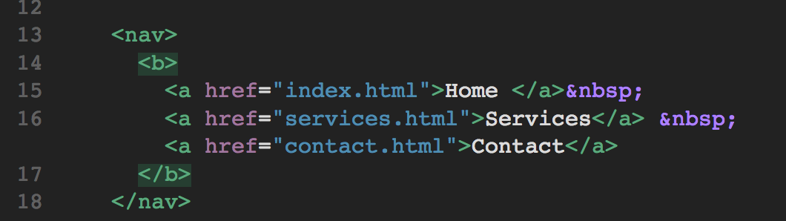
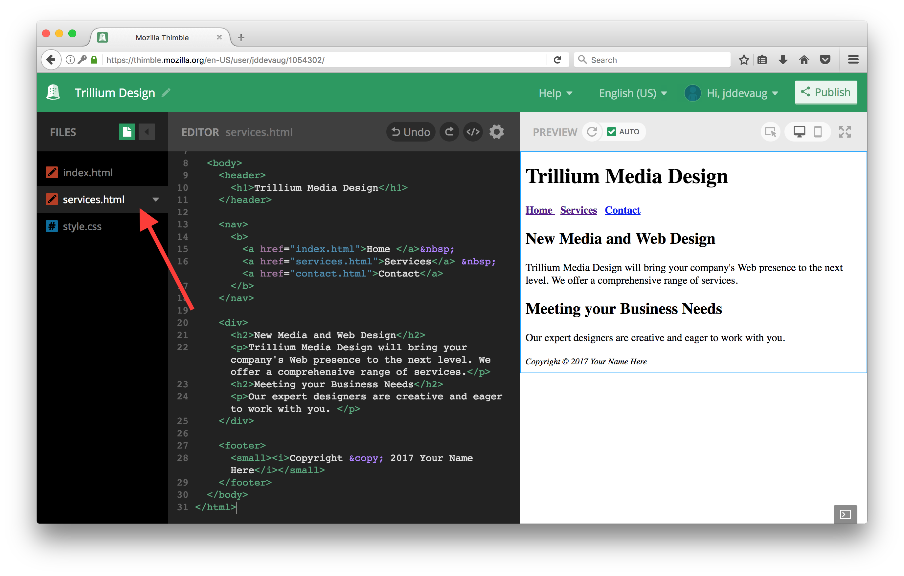
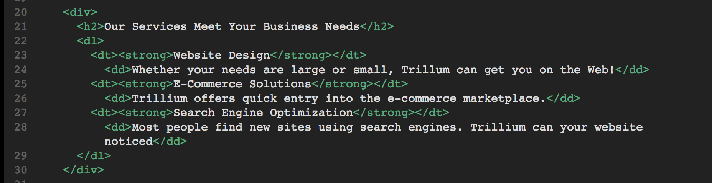
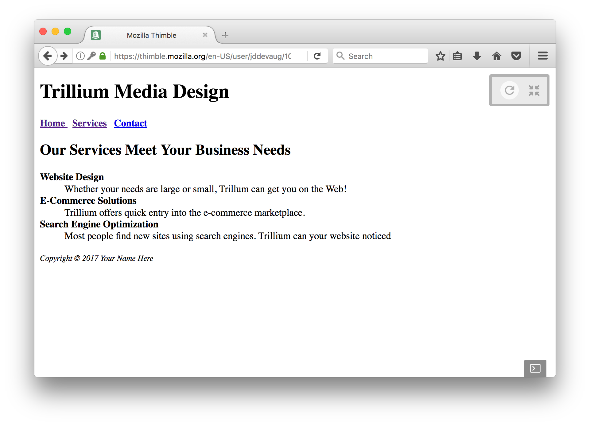
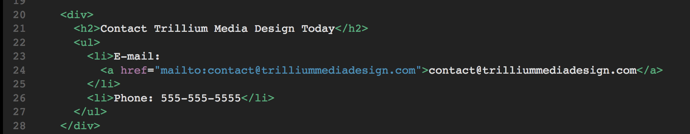
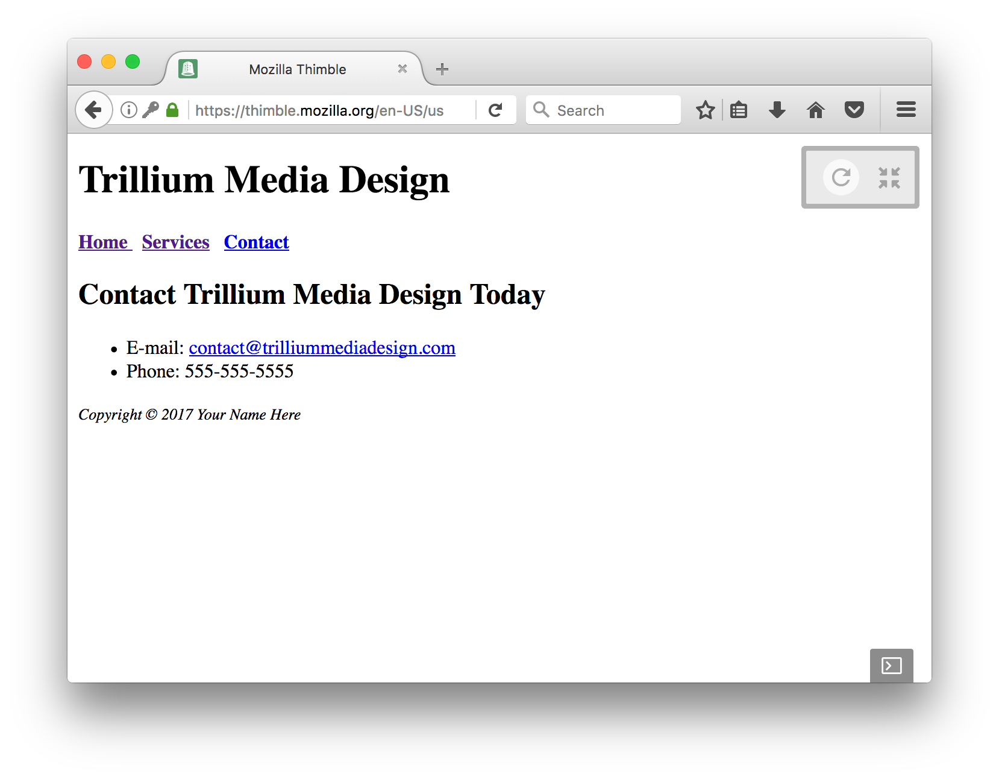

# Warmup Activity Part II

Many websites have multiple websites associated with it. We are going to create multiple websites associated with our website and link them. 

1. The navigation hyperlinks will be located within the nav element. You will edit the code within the nav element to configure three hyperlinks. 
  - The text "Home" will hyperlink to index.html
  - The text "Services" will hyperlink to services.html
  - The text "Contact" will hyperlink to contact.html
  
  Modify the code within the nav element as follows:
  
  
2. Create a new file by clicking the green button next to Files in the top left corner and selecting `Add HTML File`
   - Rename it to services.html and copy over the code from your Home page so it looks like so: 
   
   
   - Modify the title of the web page by changing the text between the `<title>` and `</title>` tags to "Trillium Media Design - Services". 
   
   - Delete the code and text between the opening and closing div tags and replace it with: 
   
   
   - Your page should look like this: 
   
   
3. Create the Contact Page by clicking the green button next to Files in the top left corner and selecting `Add HTML File` 
  - Rename it to contact.html and copy over the code from your Home page like you did for services.html
  
  - Modify the title to "Trillium Media Design - Contact" 
  
  - Delete the code between the opening and closing div tag and replace it with: 
  
  
  - Your page should look like this:
  
  
  ## Done 
  
  Great job. Now move on to [Day 1 Challenge](../day1Challenge)

